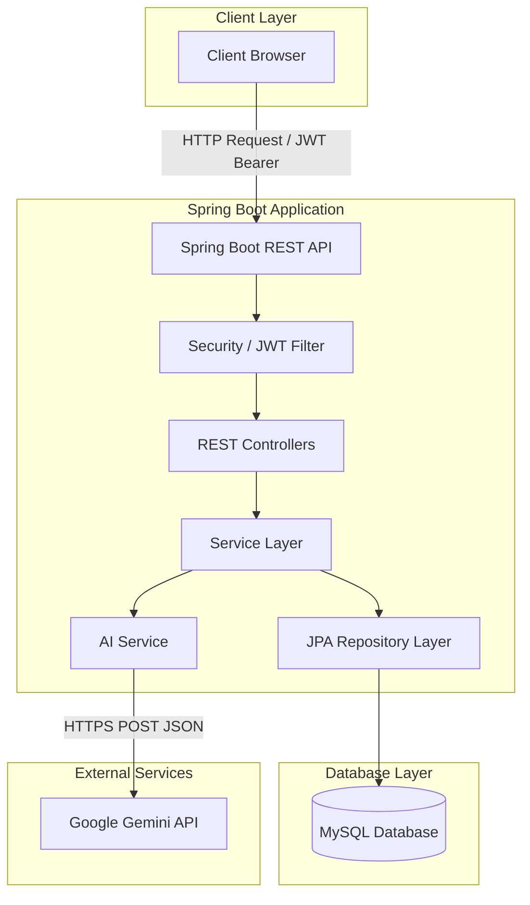

# Smart Interview Preparation Platform

An interactive, AI-powered mock interview and technical practice web application built on Spring Boot, JPA, MySQL, and Thymeleaf/Tailwind.

---

## Project Overview
The **Smart Interview Preparation Platform** is designed to help candidates prepare for coding, system design, and behavioral interviews. It features interactive coding quizzes with server-side grading, profile statistics, and an advanced **AI Mock Interview** module powered by Google Gemini (`gemini-2.5-flash`), delivering turn-by-turn chat practice and granular diagnostic feedback.

---

## Project Objective
To provide a production-ready, secure, and performant web environment where students can test their knowledge using authoritative quizzes, practice interactive interviewing with a virtual AI recruiter, and receive clear gap analysis reports detailing strengths, weaknesses, and reference answers.

---

## Key Features
* **AI Mock Interviews**: Turn-by-turn interactive technical and HR round simulation.
* **Granular AI Evaluation**: Generates diagnostic scores (0-10), candidate strengths, technical gaps/weaknesses, omitted terminology, actionable suggestions, and reference answers.
* **Interactive Quiz Engine**: Question navigation paging, timer limits, and secure server-side scoring.
* **Stateless Token Security**: JWT authorization, role checks (ADMIN vs USER), and user profile ownership verification.
* **Production Tuning**: Disabled Spring Open-In-View (OSIV) to maximize database connection pool performance.
* **Admin Dashboard**: Web forms for Questions CRUD, Quiz creation, and linkage.

---

## Technology Stack
* **Language/Framework**: Java 21, Spring Boot 4.0.7
* **Database**: MySQL 8.0 with Spring Data JPA & Hibernate
* **Security**: Spring Security, JWT (HMAC-SHA256)
* **Frontend**: HTML5, Thymeleaf, Tailwind CSS, Vanilla JS (Stateless client style)
* **LLM Integration**: Native HttpClient querying Google Gemini API

---

## System Architecture Overview



---

## Project Structure

```
smart-interview-platform/
├── src/
│   ├── main/
│   │   ├── java/com/mdsaifullah/smartinterview/
│   │   │   ├── controller/      # REST API Controllers (endpoints, security checks)
│   │   │   ├── dto/             # Data Transfer Objects (Gemini response bindings)
│   │   │   ├── entity/          # JPA Entities (User, Quiz, Question, Result, Session, Answer)
│   │   │   ├── repository/      # Spring Data JPA Repository Interfaces
│   │   │   ├── security/        # Security Configurations (JWT Filters, Cors, Custom Filter Chain)
│   │   │   └── service/         # Service Layer (Business rules, validations, transactions)
│   │   └── resources/
│   │       ├── static/          # Web frontend (HTML pages, CSS, JS helper scripts)
│   │       └── application.properties # Core configurations (Data sources, JWT properties)
│   └── test/                    # Integration and Unit tests
├── pom.xml                      # Maven project configuration and dependencies
└── PROJECT_STATUS.md            # Living project milestone tracker
```

### Purpose of Key Directories:
* `src/main/java`: Houses the source code grouped logically by package layers.
* `src/main/resources/static`: Static web directory serving web components (landing, login, dashboards) using Vanilla JS API fetches.
* `src/test`: Houses the integration test suite validating REST flows and service logic.
* `pom.xml`: Defines dependencies (Spring Boot Starters, JJWT, Jackson, MySQL driver, Lombok).

### Core Backend Layers:
* **Controller**: Exposes REST endpoints, parses payload requests, and returns JSON models.
* **Service**: Runs business validations (e.g. Email regex, password length rules, quiz grading, Gemini call formats) under active `@Transactional` boundaries.
* **Repository**: Handles Hibernate database CRUD queries.
* **Entity**: Mapped JPA classes defining the relational DB table models.
* **Security**: Decodes JWT headers and manages endpoint authorizations.
* **DTO**: Binds raw API response structures into structured classes.
* **AI Integration**: Custom services interacting with LLM REST APIs.

---

## Why This Project is Different (Portfolio Presentation)
* **Production-Oriented Database Connection Pool Tuning**: Disabled Spring Open-In-View (`spring.jpa.open-in-view=false`) to prevent database pool starvation. Connections are closed as soon as transaction boundaries finish.
* **Explicit Lazy Fetching**: Solved the resulting `LazyInitializationException` inside transactional service methods using manual fetch size hits, maintaining high database efficiency.
* **authoritative Server-Side Validation**: Scores, correct options, and user details are verified server-side. The frontend is never trusted with calculations.
* **Strict Boot Assertions**: Rejects startup if the `JWT_SECRET` key is missing or is too short (< 256 bits), ensuring security compliance.
* **turn-based AI Simulation**: Instead of static forms, Gemini is orchestrated turn-by-turn, capturing user answers, computing diagnostics, and locking session state.

---

## Environment Variables Required
Configure the following parameters in your local shell before boot:
* `JWT_SECRET`: HS256 HMAC-SHA key of $\ge 32$ bytes.
* `DB_USER`: Local MySQL user credentials username (e.g. `root`).
* `DB_PASSWORD`: Password matching the database user.
* `GEMINI_API_KEY`: Google AI Developer token.

---

## Installation & Setup Instructions

### 1. Build Verification
Clean and run tests using the Maven wrapper:
```bash
./mvnw clean test
```

### 2. Package Executable JAR
```bash
./mvnw clean package
```

### 3. Run the Application
Start the jar, setting variables in shell:
```bash
# PowerShell Example
$env:JWT_SECRET="demo_signing_secret_key_long_enough_256_bits_value"; $env:DB_USER="root"; $env:DB_PASSWORD="your_db_password"; $env:GEMINI_API_KEY="your_api_key"
java -jar target/smart-interview-platform-0.0.1-SNAPSHOT.jar
```
Tomcat starts on port `8080`. Browse to `http://localhost:8080`.

---

## Core API Catalog

### Authentication / User endpoints
* `POST /api/users/register` [PermitAll] - Register new user account.
* `POST /api/users/login` [PermitAll] - Login, returns stateless JWT token.
* `GET /api/users/{id}` [Authenticated] - Get profile (Checks principal ID ownership).
* `PUT /api/users/{id}` [Authenticated] - Update profile (Validates email structure, password length).

### Practice Quiz endpoints
* `GET /api/quizzes` [Authenticated] - List active quizzes.
* `GET /api/quizzes/{id}` [Authenticated] - Get quiz questions (Answers stripped).
* `POST /api/results/submit` [Authenticated] - Authoritative quiz submission & grading.
* `GET /api/results/user/{userId}` [Authenticated] - User's quiz result history.

### AI Mock Interview endpoints
* `POST /api/interviews/start?category={cat}` [Authenticated] - Initialize chat session.
* `POST /api/interviews/{sessionId}/submit` [Authenticated] - Submit response (Checks 10-1000 char bounds).
* `POST /api/interviews/{sessionId}/next` [Authenticated] - Load next turn question.
* `POST /api/interviews/{sessionId}/finish` [Authenticated] - Compile diagnostic reports.
* `GET /api/interviews/history` [Authenticated] - Fetch completed interview sessions.
* `GET /api/interviews/{sessionId}/report` [Authenticated] - Fetch transcript feedback.

### Admin endpoints
* `GET /api/users` [ROLE_ADMIN] - Retrieve full user roster.
* `POST /api/questions` [ROLE_ADMIN] - Create technical question.
* `PUT /api/questions/{id}` [ROLE_ADMIN] - Modify technical question.
* `DELETE /api/questions/{id}` [ROLE_ADMIN] - Safe delete question.
* `POST /api/quizzes` [ROLE_ADMIN] - Construct quiz.
* `PUT /api/quizzes/{id}` [ROLE_ADMIN] - Modify quiz.
* `DELETE /api/quizzes/{id}` [ROLE_ADMIN] - Delete quiz.

---

## Security Notes
* BCrypt hashing prevents password leaks.
* JWT signatures prevent payload tamper attempts.
* Structured Logging excludes JWTs, tokens, database passwords, and API keys.
* `.gitignore` prevents local configurations and temporary files from being committed.
